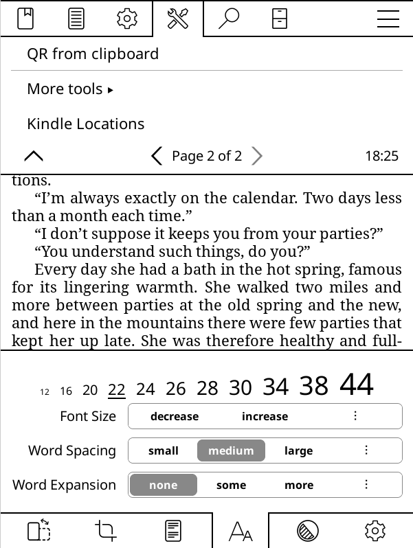

# Kindle Locations Calculator

Plugin for KOReader that tells you the number of locations in an epub file using the formula from [this MobileRead Forums post](https://www.mobileread.com/forums/showthread.php?t=159357).

[kindle-loc-calc.koplugin](kindle-loc-calc.koplugin) needs to be placed inside the plugins folder in koreader. Inside of it, there is a folder called epub_html_sumsize, with a single binary file also called epub_html_sumsize. This binary can be compiled from the code provided inside the [epub_html_sumsize/src](epub_html_sumsize/src) folder.
I compiled it using this command on WSL from the [epub_html_sumsize](epub_html_sumsize) directory:
```bash
arm-linux-gnueabihf-gcc -O3 -march=armv7-a -mfpu=neon-vfpv3 -mfloat-abi=hard -static src/main.c src/miniz.c -o build/arm/epub_html_sumsize
```
This binary works on my Kindle PW3 and should work on every [kindle with a Freescale/NXP i.MX6 SoloLite CPU](https://en.wikipedia.org/wiki/Amazon_Kindle). If that is not the case of your device, you will need to compile the c code yourself. Any LLM should be able to provide you with the appropiate compilation script.

The output will be inside the epub_html_sumsize/src/build/arm folder. If compilation fails, try to create the folder before compiling. After you have the file, place it in the appropiate folder and replace the other binary.

Once finished, you should have the following folder structure inside of koreader:

```text
koreader/
│
└── plugins/
    │
    └── kindle-loc-calc.koplugin/
        ├── main.lua
        ├── _meta.lua
        └── epub_html_sumsize/
            └── epub_html_sumsize    # ARM binary (no extension)
```
The plugin will add a new menu entry in the "Tools" menu, and also a new action that can be associated with a gesture.

<p align="center">
  
</p>

When executed, the following window will appear:

<p align="center">
  
</p>

## How it works
The lua code is a wrapper around the binary. It calls the binary with the currently open file as argument. If the currently open file is not an epub, an error message will return. If it is an epub it will look for all html-like files inside of it and sum its sizes. Then with some simple math lua will calculate the total number of locations. The current locations is an approximation, using current_page / total_pages * total_locations.

## Licences
This repo includes [Miniz](https://github.com/richgel999/miniz), so the files [miniz.c](epub_html_sumsize/src/miniz.c) and [miniz.h](epub_html_sumsize/src/miniz.h) fall under their license. For anything else I don't care really, do whatever you want. I created this using the hello.koplugin as a base and asked ChatGPT for the c code.

## Comment
A big thank you to the KOReader gang, to every developer, to every donor, and to every user. This software is fantastic and brings new life into our devices. I created this plugin because after years of reading in the Kindle ecosystem I had grown used to the "location" unit for telling how long a books is. I would open a new book, see 11000 locations and think "oof, this one is tough", so I missed that in KOReader. I would have liked to add this to the Status Bar but it seemed to me like that is not possible, the code for it runs deep inside KOReader and cannot be modified with a simple plugin.

Any pull requests, comments, complaints or outright destructive criticism is appreciated! I am just glad someone can find this useful/interesting.
